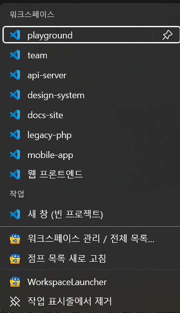
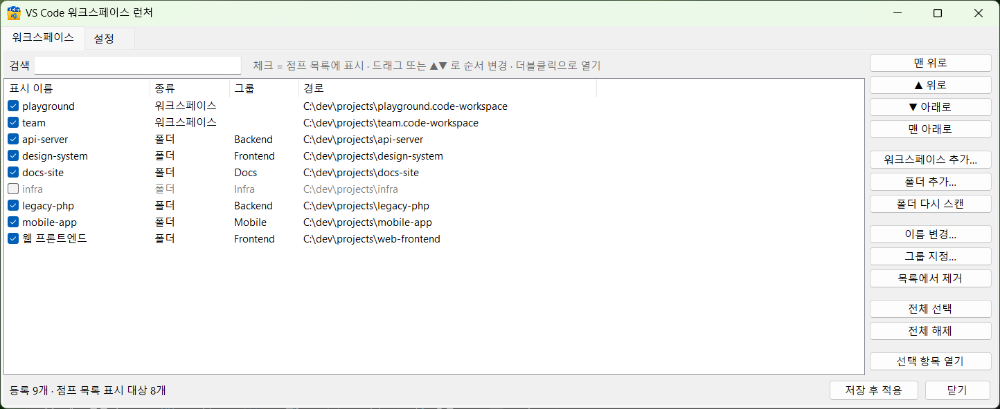
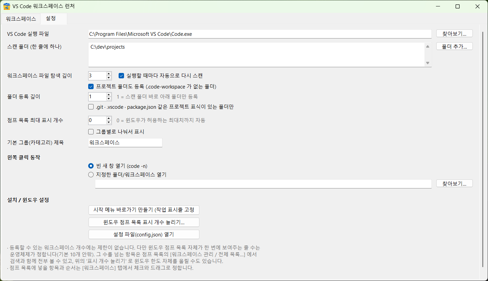

# VS Code Workspace Launcher

English · [한국어](README.md)

A Windows 11 taskbar launcher for VS Code workspaces.

- **Left click** → opens an empty VS Code window (`code -n`)
- **Right click** → a jump list of your `.code-workspace` files; pick one and VS Code opens with it
- **No limit** on how many workspaces you register, and you can reorder them freely

No .NET SDK required — it builds with the .NET Framework compiler (`csc.exe`) that ships with Windows.



Right-clicking the taskbar icon. The top section lists the registered workspaces and project
folders; the **작업** (Tasks) section below is always present.

> **Note:** the application's user interface is in Korean. The code, build scripts and this
> document are in English, but the window labels, dialogs and jump list entries are not
> localized yet.

## Requirements

| | |
|---|---|
| OS | Windows 10 / 11 |
| Runtime | .NET Framework 4.x — preinstalled on Windows 10/11 |
| Build tools | none (`C:\Windows\Microsoft.NET\Framework64\v4.0.30319\csc.exe`) |
| VS Code | must be installed (stable / Insiders / `PATH` are auto-detected) |

---

## Install

From PowerShell:

```powershell
git clone https://github.com/keneslab/vscode-workspace-launcher.git
cd vscode-workspace-launcher
.\install.ps1
```

This builds the executable, creates a Start Menu shortcut and registers the jump list.

Then **pin it to the taskbar**:

1. Start → All apps → `VS Code 워크스페이스`
2. Right click → More → **Pin to taskbar**

> Pinning `bin\WorkspaceLauncher.exe` directly works just as well. The jump list is bound to
> the executable's path, so **if you move the executable**, pin it again and run
> `WorkspaceLauncher.exe --refresh` once.

If no workspace folder is found on first run the list starts empty. Open the jump list →
`워크스페이스 관리 / 전체 목록…` → **설정** (Settings) tab and point it at a folder that
contains `.code-workspace` files.

---

## Usage

### Taskbar icon

| Action | Result |
|---|---|
| Left click | Empty VS Code window (configurable to open a specific folder instead) |
| Right click | Jump list — pick a workspace to open it in VS Code |

The **Tasks** section of the jump list always contains:

- `새 창 (빈 프로젝트)` — new empty window
- `워크스페이스 관리 / 전체 목록…` — open the manager window
- `점프 목록 새로 고침` — rescan folders and rebuild the jump list

### Manager window

Open it from the jump list, or run `WorkspaceLauncher.exe --manage`.

**Workspaces tab**



- Checkbox = show this entry in the jump list
- Reorder by **drag and drop** or the **▲ / ▼ / top / bottom** buttons (multi-select works)
- Double click or `Enter` opens the selected workspace
- The search box filters by name, path and group (reordering is disabled while filtering)
- Add entries outside the scanned folders with `워크스페이스 추가…` / `폴더 추가…`
- `이름 변경…` sets the display name, `그룹 지정…` assigns a category
- Grey = hidden from the jump list, red = the path no longer exists
- Closing the window saves and reapplies the jump list

**Settings tab**



| Setting | Description |
|---|---|
| VS Code executable | Leave empty to auto-detect |
| Scan folders | One per line |
| Workspace file depth | How deep to look for `.code-workspace` files (default 3) |
| Rescan on every launch | New workspaces get picked up on the next click |
| Register project folders | Also register folders with no `.code-workspace` (on by default) |
| Folder depth | `1` = only folders directly inside a scan folder (default 1) |
| Only folders with a project marker | Require `.git`, `.vscode`, `package.json`, … |
| Max jump list entries | `0` = as many as Windows allows |
| Group into categories | Split the jump list by the `Group` value |
| Left click action | Empty new window, or open a specific folder |

### Scanning rules

A scan folder is searched for two kinds of entry: **`.code-workspace` files** and
**project folders**.

- The scan folder itself is never registered — it is treated as a container for projects.
  To register a single folder, use `폴더 추가…` (Add folder).
- A folder that contains a `.code-workspace` file is represented by that file, so it is not
  registered as a folder as well.
- Dot-folders, hidden folders, symlinks and `node_modules`, `vendor`, `bin`, `obj`, `dist`,
  `build` and friends are skipped (tune `ExcludeDirs` in `config.json`).
- Paths that are already registered are never added twice, and **existing entries keep their
  order** — new entries are appended at the end.

If your projects live one level deeper, as `<root>/<category>/<project>`, use **folder depth 2
with the project marker requirement on**: the category folders have no marker and get filtered
out, leaving just the projects.

### Command line

```
WorkspaceLauncher.exe                 empty VS Code window
WorkspaceLauncher.exe --open <path>   open that workspace or folder
WorkspaceLauncher.exe --manage        manager window
WorkspaceLauncher.exe --refresh [-v]  rescan and rebuild the jump list
WorkspaceLauncher.exe --install       Start Menu shortcut + jump list registration
WorkspaceLauncher.exe --clear         remove the jump list
```

---

## About the entry limit

There is no limit on how many workspaces you can register. **How many rows the jump list
actually shows is decided by Windows**, though — around 10 by default, and it does not
scroll. That is a shell constraint, not an application one, so the tool works around it in
two ways:

1. **Everything that does not fit lives in the manager window.** `워크스페이스 관리 /
   전체 목록…` in the jump list opens a searchable list with no limit.
2. **Raise the Windows limit.** Settings tab → `윈도우 점프 목록 표시 개수 늘리기…` sets
   `JumpListItems_Maximum` under
   `HKCU\Software\Microsoft\Windows\CurrentVersion\Explorer\Advanced` and restarts Explorer.
   20–30 is a reasonable value. It asks for confirmation first, because every open Explorer
   window closes. Entries beyond what fits on screen are still cut off.

Move the workspaces you use most to the top of the list and they go into the jump list first.

---

## Configuration file

`%APPDATA%\WorkspaceLauncher\config.json`, safe to edit by hand.
**The order of the `Items` array is the order of the jump list.**

```json
{
  "Name": "My project",
  "Path": "D:\\projects\\my-project\\my-project.code-workspace",
  "Show": true,
  "Group": "Work",
  "ExtraArgs": ""
}
```

| Key | Meaning |
|---|---|
| `Name` | Display name in the jump list; `null` falls back to the file name |
| `Path` | A `.code-workspace` file or a folder |
| `Show` | Whether it appears in the jump list |
| `Group` | Category name, used when `GroupByCategory` is `true` |
| `ExtraArgs` | Extra arguments passed to `code.exe` |

Run `WorkspaceLauncher.exe --refresh` to apply your edits.

`%APPDATA%\WorkspaceLauncher\launcher.log` is created only when something goes wrong.

---

## Build

```powershell
.\build.ps1
```

Uses `C:\Windows\Microsoft.NET\Framework64\v4.0.30319\csc.exe`. The sources are written in
**C# 5** to match that compiler — no string interpolation, no `?.`, no `nameof`.

There is deliberately no `.csproj`: a stock Windows install is all you need to build this.

### Layout

| File | Role |
|---|---|
| `src/Interop.cs` | `ICustomDestinationList`, `IShellLinkW`, `IPropertyStore` COM interop |
| `src/JumpList.cs` | Builds the jump list; creates the shortcut carrying the AppUserModelID |
| `src/Config.cs` | Settings JSON, folder scanning and merging |
| `src/ManagerForm.cs` | Manager window (list, reordering, settings) |
| `src/VsCode.cs` | Launching VS Code |
| `src/Program.cs` | Command line dispatch, single instance |

---

## Sharing the build

`bin\WorkspaceLauncher.exe` is **a single self-contained file**. The icon is embedded and the
config file is created on first run. The recipient only has to run this once:

```
WorkspaceLauncher.exe --install
```

The executable is unsigned, so SmartScreen will warn if it was downloaded or emailed
(`More info` → `Run anyway`).

---

## Uninstall

1. Right click the taskbar icon → Unpin from taskbar
2. `WorkspaceLauncher.exe --clear` — removes the jump list
3. Delete `%APPDATA%\Microsoft\Windows\Start Menu\Programs\VS Code 워크스페이스.lnk`
4. Delete `%APPDATA%\WorkspaceLauncher\`
5. Delete `bin\`

The only registry value the tool touches is `JumpListItems_Maximum`, and only if you run that
action from the Settings tab yourself.

---

## License

[MIT](LICENSE)
